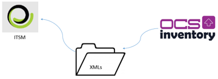

title: Set Inventory connection
Description: Intended to register all properties about the CITSmart Inventory connection, according to the IP and port where the Jboss of the CITSmart Inventory is intalled.
# Set Inventory connection

This functionality is intended to register all properties about the CITSmart
Inventory connection, according to the IP and port where the Jboss of the
CITSmart Inventory is installed.

Before getting started
--------------------------

The functionality configuration requires an application server Inventory,
functional and communicable with ITSM.

Procedure
-------------

1.  Access the functionality through the main menu Processes \> Event Management
    \> Connections \> Inventory Connections;

2.  In **Connection Data**, complete the fields;

3.  Select the type of *Inventory* connection, in the field "Ignore machines
    already inventoried" (in the case of inventoried machines, it's possible to
    define how many days this machine will be without new inventory, and
    therefore its status will be set to Ignored until the total of days
    parameterized) two boxes will open that refer to Period and Period format,
    select the option that best fits and save the settings;

      

       Figure 1 -CITSmart inventory integration

4.  If the connection type chosen is the *OCS Inventory*, the configuration
    field of the OCS Inventory will be displayed to be informed of the XML
    repository, as shown below. In addition, there are some very
    relevant **prerequisites** that should be observed:

       
   

       Figure 2 -CITSmart inventory integration - OCS inventory

       + After installing OCS Inventory, it does not default to any type of
         integration with another system, so in the Inventory files menu you need to
         assign GENERATE_OCS_FILES = ON, OCS_FILES_FORMAT = XML and specify the path
         where the XML files will be stored in OCS_FILES_PATH

       + The location specified for generating XML files is very strategic:

          + If the OCS server is the same as Inventory Server, this is the least
            risk because the folder is likely to be readable;

          + If the OCS server is **NOT** the same Inventory server, you must choose
            one of these two options:

               + the OCS Inventory must be allowed to save to the Inventory server;

               + the Inventory must have permission (share) on the OCS Inventory
                 server.

5.  The Inventory application captures the data through the SNMP Agent (161)
    port and/or the Capture Agent (port 7103 developed by CITSmart Corporation,
    in .Net). Initially, Inventory performs a "ping" command to verify that the
    machine is active. If you can perform the command, try to access the SNMP
    port of the configuration item. If access to the port is not successful,
    Inventory tries to access through the capture agent by clicking the "Test
    Connection" button;

6.  Click on "Save and Apply Settings".

Related
-------

[Register Inventory manager](/en-us/citsmart-7/processes/event/configuration/register-inventory-manager.html)

!!! tip "About"

    <b>Product/Version:</b> CITSmart | 7.00 &nbsp;&nbsp;
    <b>Updated:</b>01/10/2019 - Anna Martins
